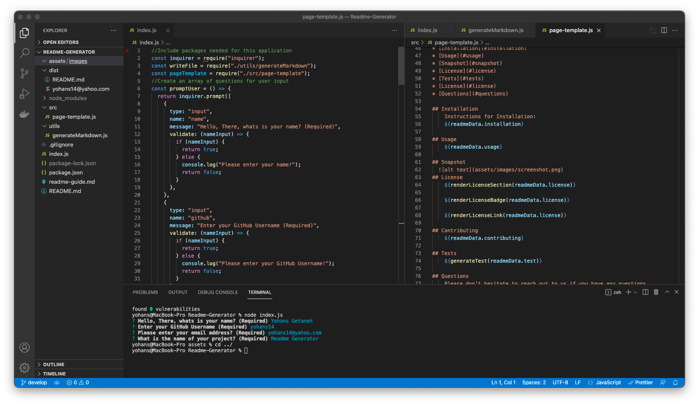

# Readme-Generator

## Description

This is a command line application that helps developer to generate a professional readme using Node from the command line.

## Table of Contents

- [Installation](#installation)
- [Usage](#usage)
- [Snapshot](#snapshot)
- [License](#license)
- [Tests](#tests)
- [License](#license)
- [Questions](#questions)

## Installation

Instructions for Installation:
To install this application follow the GitHub link and clone the project to your local machine and open on your command line after installing Node.js.

## Usage

To use in the root dir install inquirer package by using -npm install inquirer command. Then application can be launched by runnig node.js in the command line.

## Snapshot

Video

## License

The project is licensed under MIT.

[More Info](https://choosealicense.com/licenses/)

## Contributing

If you like to contribut for this project please follow The Contributor Convenant guidelines.

## Tests

## Questions

Please don't hesitate to reach out to us if you have any questions.

Yohans Getaneh

GitHub: https://github.com/yohans14

Email: yohans14@yahoo.com
